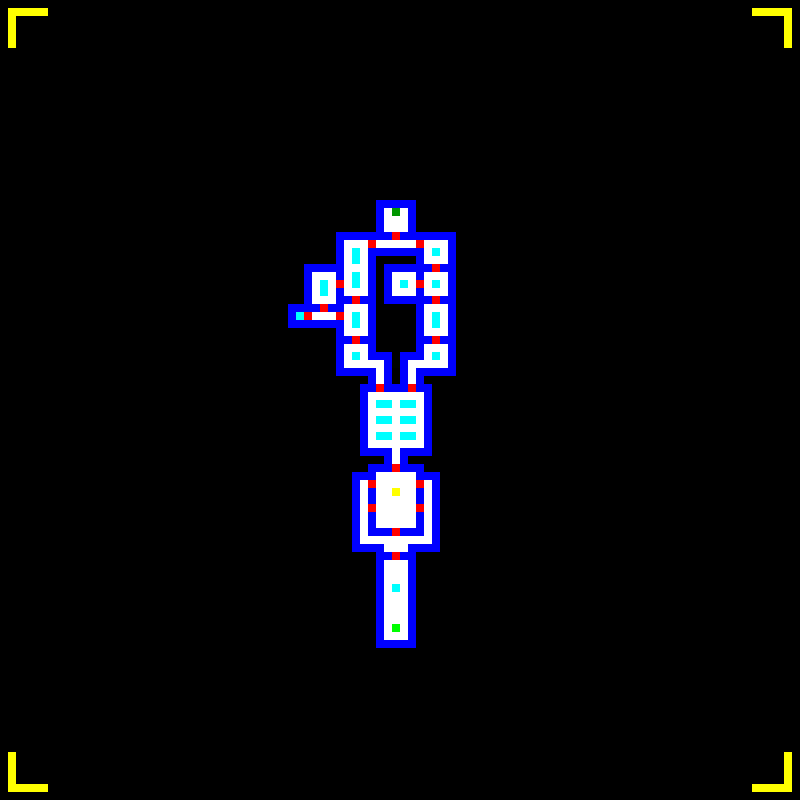
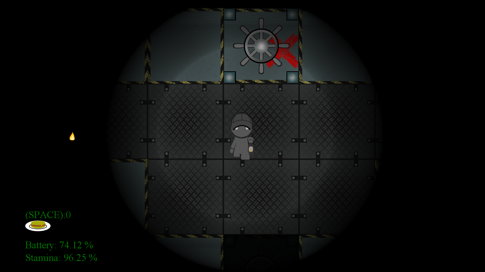

## Map class explanation

In simplest terms, the Map class is able to turn images (bitmaps specifically) into map objects to create a map. (Expanded by 500% for visibility)

 

The first image was run through the code and was fully realized into game objects in the image below (each 5x5 color block in the image above correlates to a square map object below). The player is between the two lowest red blocks, or doors.

#### How does this work?

The Map class reads off the color values of the bitmap, storing them into a 2D array of colors, after which it begins to generate a new 2D array of Map Objects at the same coordinates as the pixels. The type of object is determined by the color of the pixel itself, some examples being white = floor, red = door, black = null, and yellow = enemy spawn. 

I found this approach to be a relatively easy approach to the issue of level design in MonoGame, an engine which has no inbuilt level editor. This allowed a developer (the rest of my team, for instance) to easily interface a program such as Photoshop, GIMP or paint.net with MonoGame and design levels quickly and efficiently.

#### What else does the Map class do?

Another cool thing that the Map class does is provide a good check to optimize AI code. It does this by creating and editing arrays called "rooms". rooms are essentially a collection of Map objects that are bound completely by walls. This is used primarily to determine if an AI even cares about the player, basically turning off the AI of an enemy if they are behind a locked door, in another room. This allows for potentially hundreds of AI actors in the same level with little to no preformance hit for the player.

The Map class also optimizes the graphical side of things, with rooms automatically unloading from view (and taking up less time drawing) as soon as the player leaves the room.
